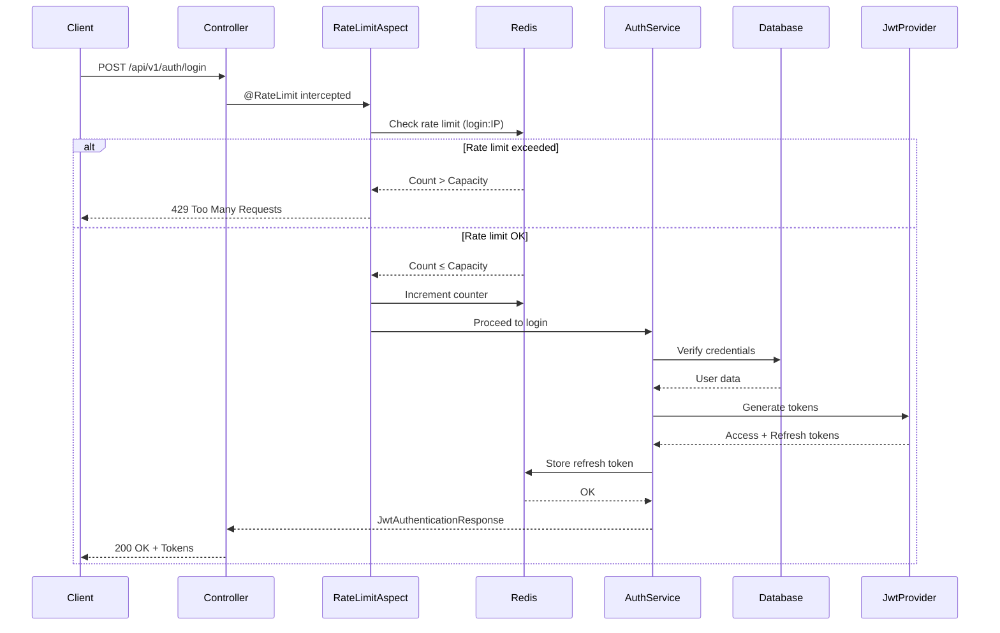
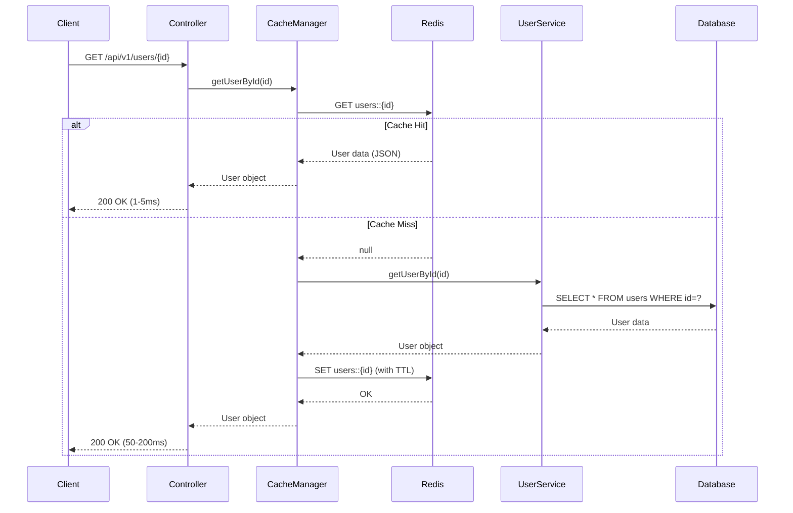
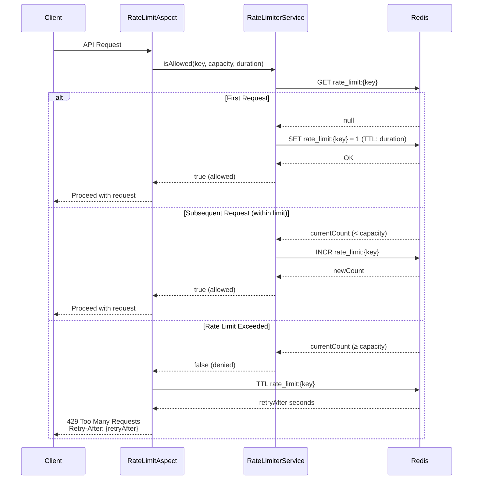
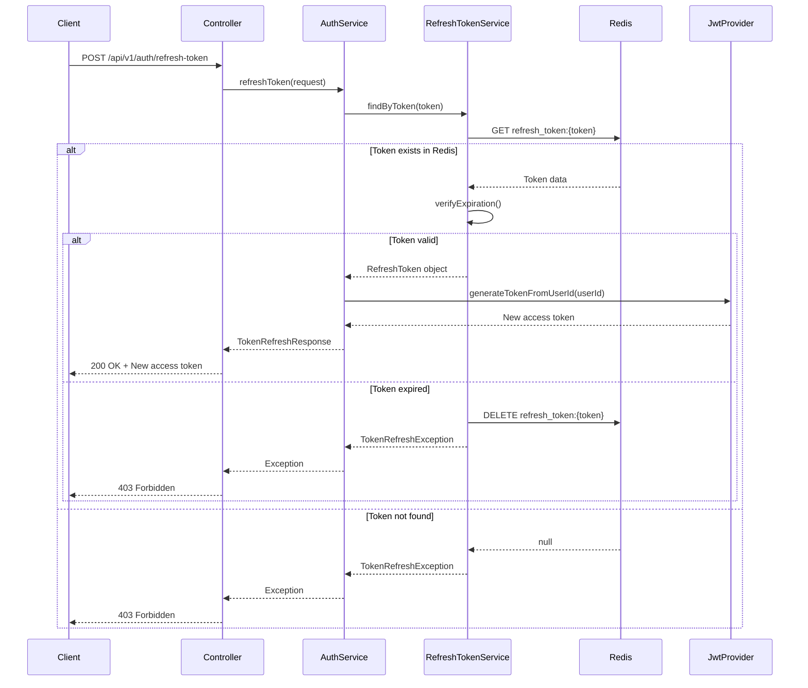
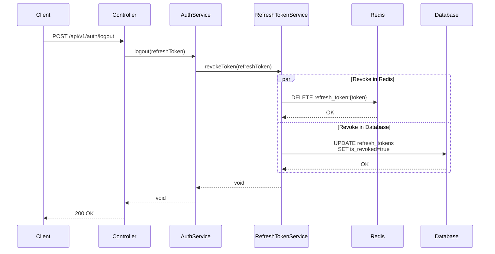

# Redis Integration Documentation

## 📚 Mục lục

1. [Giới thiệu về Redis](#giới-thiệu-về-redis)
2. [Kiến trúc Redis trong Project](#kiến-trúc-redis-trong-project)
3. [Cấu hình Redis](#cấu-hình-redis)
4. [Các Use Case sử dụng Redis](#các-use-case-sử-dụng-redis)
5. [Flow hoạt động chi tiết](#flow-hoạt-động-chi-tiết)
6. [Best Practices](#best-practices)
7. [Monitoring và Troubleshooting](#monitoring-và-troubleshooting)

---

## 🎯 Giới thiệu về Redis

### Redis là gì?

**Redis** (Remote Dictionary Server) là một **in-memory data structure store** mã nguồn mở, được sử dụng như:
- **Database**: Lưu trữ dữ liệu key-value
- **Cache**: Tăng tốc độ truy xuất dữ liệu
- **Message Broker**: Pub/Sub messaging
- **Session Store**: Quản lý phiên người dùng

### Đặc điểm nổi bật

| Đặc điểm | Mô tả |
|----------|-------|
| **Performance** | Cực nhanh (~100,000 ops/sec) vì lưu trữ trên RAM |
| **Data Structures** | String, Hash, List, Set, Sorted Set, Bitmap, HyperLogLog |
| **Persistence** | RDB (snapshot) và AOF (append-only file) |
| **Replication** | Master-Slave replication |
| **High Availability** | Redis Sentinel và Redis Cluster |
| **Atomic Operations** | Đảm bảo tính toàn vẹn dữ liệu |

### Tại sao sử dụng Redis?

```
┌─────────────────────────────────────────────────────────────┐
│                    WITHOUT REDIS                             │
├─────────────────────────────────────────────────────────────┤
│  Client → Spring Boot → PostgreSQL (Every Request)          │
│  Response Time: 50-200ms                                     │
│  Database Load: High                                         │
└─────────────────────────────────────────────────────────────┘

┌─────────────────────────────────────────────────────────────┐
│                     WITH REDIS                               │
├─────────────────────────────────────────────────────────────┤
│  Client → Spring Boot → Redis Cache (Cache Hit)             │
│  Response Time: 1-5ms (40x faster!)                          │
│  Database Load: Low (only on cache miss)                    │
└─────────────────────────────────────────────────────────────┘
```

---

## 🏗️ Kiến trúc Redis trong Project

### Tổng quan kiến trúc

```
┌──────────────────────────────────────────────────────────────────┐
│                        CLIENT LAYER                               │
│  (Web Browser, Mobile App, Postman, etc.)                        │
└────────────────────────┬─────────────────────────────────────────┘
                         │
                         ▼
┌──────────────────────────────────────────────────────────────────┐
│                   SPRING BOOT APPLICATION                         │
│                                                                   │
│  ┌────────────────┐  ┌──────────────┐  ┌──────────────┐        │
│  │  Controllers   │  │   Services   │  │  Repositories│        │
│  │  @RateLimit    │  │  @Cacheable  │  │     JPA      │        │
│  └────────┬───────┘  └──────┬───────┘  └──────┬───────┘        │
│           │                  │                  │                 │
│           ▼                  ▼                  │                 │
│  ┌────────────────┐  ┌──────────────┐         │                 │
│  │ RateLimitAspect│  │ CacheManager │         │                 │
│  │     (AOP)      │  │   (Spring)   │         │                 │
│  └────────┬───────┘  └──────┬───────┘         │                 │
│           │                  │                  │                 │
│           └──────────┬───────┘                 │                 │
│                      ▼                          ▼                 │
│           ┌──────────────────────┐   ┌──────────────────┐       │
│           │   RedisTemplate      │   │  EntityManager   │       │
│           │   RedisService       │   │                  │       │
│           └──────────┬───────────┘   └─────────┬────────┘       │
└──────────────────────┼───────────────────────────┼───────────────┘
                       │                           │
                       ▼                           ▼
        ┌──────────────────────┐      ┌──────────────────────┐
        │   REDIS SERVER       │      │  PostgreSQL Database │
        │   (Port 6379)        │      │  (Port 5432)         │
        │                      │      │                      │
        │  ┌────────────────┐  │      │  ┌────────────────┐ │
        │  │ Cache Data     │  │      │  │ Persistent Data│ │
        │  │ - Users        │  │      │  │ - users        │ │
        │  │ - Roles        │  │      │  │ - roles        │ │
        │  │ - Permissions  │  │      │  │ - permissions  │ │
        │  │ - RefreshTokens│  │      │  │ - refresh_token│ │
        │  └────────────────┘  │      │  └────────────────┘ │
        │                      │      │                      │
        │  ┌────────────────┐  │      └──────────────────────┘
        │  │ Rate Limiting  │  │
        │  │ - login:IP     │  │
        │  │ - register:IP  │  │
        │  └────────────────┘  │
        └──────────────────────┘
```

### Các thành phần chính

#### 1. **RedisConfig**
- Cấu hình `RedisTemplate` với Jackson serialization
- Cấu hình `CacheManager` với custom TTL cho từng loại cache
- Hỗ trợ Java 8 Time API (LocalDateTime, etc.)

#### 2. **RedisService**
- Interface định nghĩa các operations: String, Hash, Set, List
- Wrapper cho `RedisTemplate` với error handling
- Logging và monitoring

#### 3. **RateLimiterService**
- Implement Token Bucket algorithm
- Distributed rate limiting across multiple instances
- Fail-open strategy (allow requests if Redis is down)

#### 4. **CacheManager**
- Spring Cache Abstraction
- Automatic cache eviction based on TTL
- Support for `@Cacheable`, `@CacheEvict`, `@CachePut`

---

## ⚙️ Cấu hình Redis

### 1. Dependencies (build.gradle)

```gradle
dependencies {
    // Redis Core
    implementation 'org.springframework.boot:spring-boot-starter-data-redis'
    implementation 'io.lettuce:lettuce-core:6.3.0.RELEASE'
    implementation 'org.apache.commons:commons-pool2:2.12.0'
    
    // JSON Serialization
    implementation 'com.fasterxml.jackson.datatype:jackson-datatype-jsr310:2.16.1'
    
    // AOP for Rate Limiting
    implementation 'org.springframework.boot:spring-boot-starter-aop'
}
```

### 2. Application Configuration (application.yaml)

```yaml
spring:
  # Redis Connection
  data:
    redis:
      host: ${REDIS_HOST:localhost}
      port: ${REDIS_PORT:6379}
      password: ${REDIS_PASSWORD:}
      database: ${REDIS_DATABASE:0}
      timeout: 60000  # 60 seconds
      
      # Lettuce Connection Pool
      lettuce:
        pool:
          max-active: 20    # Maximum connections
          max-idle: 10      # Maximum idle connections
          min-idle: 5       # Minimum idle connections
          max-wait: 2000    # Maximum wait time (ms)
        shutdown-timeout: 100
      connect-timeout: 10000

  # Cache Configuration
  cache:
    type: redis
    redis:
      time-to-live: 3600000  # 1 hour default
      cache-null-values: false
      use-key-prefix: true
      key-prefix: "auth-jwt:"

# Custom Cache TTL
app:
  cache:
    ttl:
      user: 1800000           # 30 minutes
      role: 3600000           # 1 hour
      permission: 3600000     # 1 hour
      refresh-token: 604800000  # 7 days
    enabled: true

  # Rate Limiting
  rate-limit:
    enabled: true
    login:
      capacity: 5      # 5 requests
      duration: 60     # per 60 seconds
    register:
      capacity: 3      # 3 requests
      duration: 300    # per 5 minutes
    refresh-token:
      capacity: 10     # 10 requests
      duration: 60     # per 60 seconds
```

### 3. Docker Compose Setup

```yaml
version: '3.8'

services:
  redis:
    image: redis:7.2-alpine
    container_name: auth-jwt-redis
    ports:
      - "6379:6379"
    volumes:
      - redis-data:/data
    command: redis-server --appendonly yes --requirepass yourpassword
    restart: unless-stopped
    healthcheck:
      test: ["CMD", "redis-cli", "ping"]
      interval: 10s
      timeout: 3s
      retries: 3

  postgres:
    image: postgres:16-alpine
    container_name: auth-jwt-postgres
    environment:
      POSTGRES_DB: auth_jwt_db
      POSTGRES_USER: admin
      POSTGRES_PASSWORD: admin
    ports:
      - "5432:5432"
    volumes:
      - postgres-data:/var/lib/postgresql/data
    restart: unless-stopped

volumes:
  redis-data:
  postgres-data:
```

---

## 💡 Các Use Case sử dụng Redis

### 1. **Caching (User, Role, Permission)**

#### Mục đích
- Giảm số lượng queries đến PostgreSQL
- Tăng tốc độ response time
- Giảm database load

#### Implementation

```java
@Service
public class UserServiceImpl implements UserService {
    
    @Cacheable(value = "users", key = "#id")
    public User getUserById(Long id) {
        // Chỉ query database khi cache miss
        return userRepository.findById(id)
            .orElseThrow(() -> new ResourceNotFoundException("User", "id", id));
    }
    
    @CacheEvict(value = "users", key = "#user.id")
    public User updateUser(User user) {
        // Xóa cache khi update
        return userRepository.save(user);
    }
    
    @CacheEvict(value = "users", allEntries = true)
    public void clearAllUserCache() {
        // Xóa toàn bộ user cache
    }
}
```

#### Cache Flow

```
┌─────────────────────────────────────────────────────────────┐
│                    CACHE READ FLOW                           │
└─────────────────────────────────────────────────────────────┘

1. Client Request
   │
   ▼
2. Check Redis Cache
   │
   ├─ Cache HIT ──────────────────────┐
   │                                   │
   │                                   ▼
   │                          Return from Cache (1-5ms)
   │
   └─ Cache MISS
      │
      ▼
   3. Query PostgreSQL (50-200ms)
      │
      ▼
   4. Store in Redis Cache (with TTL)
      │
      ▼
   5. Return to Client
```

### 2. **Rate Limiting**

#### Mục đích
- Ngăn chặn brute force attacks
- Bảo vệ API khỏi abuse
- Đảm bảo fair usage

#### Token Bucket Algorithm

```
┌─────────────────────────────────────────────────────────────┐
│                  TOKEN BUCKET ALGORITHM                      │
└─────────────────────────────────────────────────────────────┘

Bucket Capacity: 5 tokens
Refill Rate: 5 tokens per 60 seconds

Time    Tokens  Request  Result
─────────────────────────────────────
0s      5       ✓        Allowed (4 remaining)
10s     4       ✓        Allowed (3 remaining)
20s     3       ✓        Allowed (2 remaining)
30s     2       ✓        Allowed (1 remaining)
40s     1       ✓        Allowed (0 remaining)
50s     0       ✗        DENIED (Rate limit exceeded)
60s     5       ✓        Allowed (bucket refilled)
```

#### Redis Implementation

```
Key: rate_limit:login:192.168.1.100
Value: 3
TTL: 45 seconds

Commands:
1. GET rate_limit:login:192.168.1.100  → 3
2. INCR rate_limit:login:192.168.1.100 → 4
3. If value > capacity → Reject request
4. If value ≤ capacity → Allow request
```

### 3. **Session Management**

#### Mục đích
- Lưu trữ refresh tokens
- Quản lý active sessions
- Revoke tokens khi logout

#### Implementation

```java
@Service
public class RefreshTokenService {
    
    private final RedisService redisService;
    private static final String TOKEN_PREFIX = "refresh_token:";
    
    public void storeRefreshToken(String token, Long userId, long expirationMs) {
        String key = TOKEN_PREFIX + token;
        RefreshTokenData data = new RefreshTokenData(userId, System.currentTimeMillis());
        redisService.set(key, data, expirationMs, TimeUnit.MILLISECONDS);
    }
    
    public boolean isTokenValid(String token) {
        String key = TOKEN_PREFIX + token;
        return redisService.hasKey(key);
    }
    
    public void revokeToken(String token) {
        String key = TOKEN_PREFIX + token;
        redisService.delete(key);
    }
}
```

### 4. **Distributed Locking**

#### Mục đích
- Đảm bảo chỉ một instance xử lý critical operation
- Prevent race conditions trong môi trường distributed

#### Implementation

```java
public boolean acquireLock(String lockKey, String lockValue, Duration timeout) {
    return redisService.setIfAbsent(lockKey, lockValue, timeout);
}

public void releaseLock(String lockKey, String lockValue) {
    String currentValue = redisService.get(lockKey, String.class);
    if (lockValue.equals(currentValue)) {
        redisService.delete(lockKey);
    }
}
```

---

## 🔄 Flow hoạt động chi tiết

### 1. Authentication Flow với Redis



### 2. Cache Flow (Get User)



### 3. Rate Limiting Flow



### 4. Refresh Token Flow với Redis



### 5. Logout Flow với Redis



---

## 📊 Data Structure trong Redis

### 1. Cache Keys Structure

```
auth-jwt:users::{userId}
├─ Value: User object (JSON)
├─ TTL: 30 minutes
└─ Example: auth-jwt:users::123

auth-jwt:roles::{roleId}
├─ Value: Role object (JSON)
├─ TTL: 1 hour
└─ Example: auth-jwt:roles::1

auth-jwt:permissions::{permissionId}
├─ Value: Permission object (JSON)
├─ TTL: 1 hour
└─ Example: auth-jwt:permissions::5
```

### 2. Rate Limit Keys Structure

```
rate_limit:{operation}:{clientId}
├─ Value: Request count (Integer)
├─ TTL: Duration (seconds)
└─ Examples:
    - rate_limit:login:192.168.1.100
    - rate_limit:register:10.0.0.5
    - rate_limit:refresh-token:172.16.0.1
```

### 3. Refresh Token Keys Structure

```
refresh_token:{tokenValue}
├─ Value: RefreshToken object (JSON)
├─ TTL: 7 days
└─ Example: refresh_token:eyJhbGciOiJIUzUxMiJ9...
```

### 4. Session Keys Structure

```
session:{userId}:{sessionId}
├─ Value: Session data (Hash)
├─ Fields:
│   ├─ device_info
│   ├─ ip_address
│   ├─ created_at
│   └─ last_activity
└─ TTL: 7 days
```

---

## 🎯 Best Practices

### 1. **Key Naming Convention**

```
{application}:{entity}:{identifier}

✅ Good:
- auth-jwt:users::123
- auth-jwt:roles::admin
- rate_limit:login:192.168.1.100

❌ Bad:
- user123
- role_admin
- login_limit
```

### 2. **TTL Strategy**

| Data Type | TTL | Rationale |
|-----------|-----|-----------|
| User Cache | 30 min | Frequently updated |
| Role Cache | 1 hour | Rarely changes |
| Permission Cache | 1 hour | Rarely changes |
| Refresh Token | 7 days | Match token expiration |
| Rate Limit | 1-5 min | Short-lived |

### 3. **Error Handling**

```java
// ✅ Good: Fail-open strategy
try {
    boolean allowed = rateLimiterService.isAllowed(key, capacity, duration);
    if (!allowed) {
        throw new RateLimitExceededException(...);
    }
} catch (RedisConnectionException e) {
    log.error("Redis connection failed, allowing request", e);
    // Allow request to proceed if Redis is down
}

// ❌ Bad: Fail-closed strategy
boolean allowed = rateLimiterService.isAllowed(key, capacity, duration);
if (!allowed) {
    throw new RateLimitExceededException(...);
}
// If Redis is down, this will throw exception and block all requests
```

### 4. **Connection Pooling**

```yaml
spring:
  data:
    redis:
      lettuce:
        pool:
          max-active: 20    # Adjust based on load
          max-idle: 10      # Keep some connections ready
          min-idle: 5       # Minimum warm connections
          max-wait: 2000    # Don't wait too long
```

### 5. **Serialization**

```java
// ✅ Good: Use Jackson with type information
ObjectMapper mapper = new ObjectMapper();
mapper.activateDefaultTyping(
    LaissezFaireSubTypeValidator.instance,
    ObjectMapper.DefaultTyping.NON_FINAL,
    JsonTypeInfo.As.PROPERTY
);

// ❌ Bad: Default Java serialization (slow and version-dependent)
```

### 6. **Cache Eviction**

```java
// ✅ Good: Evict cache on update
@CacheEvict(value = "users", key = "#user.id")
public User updateUser(User user) {
    return userRepository.save(user);
}

// ✅ Good: Evict all cache when needed
@CacheEvict(value = "users", allEntries = true)
public void clearAllUserCache() {
    // Clear all user cache
}

// ❌ Bad: Never evict cache (stale data)
```

---

## 🔍 Monitoring và Troubleshooting

### 1. **Redis CLI Commands**

```bash
# Connect to Redis
redis-cli -h localhost -p 6379 -a yourpassword

# Check all keys
KEYS *

# Get specific key
GET auth-jwt:users::123

# Check TTL
TTL auth-jwt:users::123

# Get all rate limit keys
KEYS rate_limit:*

# Monitor real-time commands
MONITOR

# Get Redis info
INFO
INFO stats
INFO memory

# Check connection
PING

# Flush all data (DANGEROUS!)
FLUSHALL
```

### 2. **Metrics to Monitor**

| Metric | Command | Threshold |
|--------|---------|-----------|
| Memory Usage | `INFO memory` | < 80% |
| Connected Clients | `INFO clients` | < max_clients |
| Hit Rate | `INFO stats` | > 80% |
| Evicted Keys | `INFO stats` | Low |
| Expired Keys | `INFO stats` | Normal |

### 3. **Common Issues**

#### Issue 1: High Memory Usage

```bash
# Check memory
INFO memory

# Find large keys
redis-cli --bigkeys

# Solution: Reduce TTL or increase memory
```

#### Issue 2: Low Cache Hit Rate

```bash
# Check stats
INFO stats

# keyspace_hits / (keyspace_hits + keyspace_misses) < 0.8

# Solution: Increase TTL or review caching strategy
```

#### Issue 3: Connection Timeout

```yaml
# Increase timeout in application.yaml
spring:
  data:
    redis:
      timeout: 60000  # 60 seconds
      connect-timeout: 10000  # 10 seconds
```

### 4. **Logging**

```yaml
# Enable Redis logging
logging:
  level:
    org.springframework.data.redis: DEBUG
    io.lettuce.core: DEBUG
    com.jwt.auth.auth_jwt.service.impl.RedisServiceImpl: DEBUG
```

### 5. **Health Check**

```java
@Component
public class RedisHealthIndicator implements HealthIndicator {
    
    private final RedisTemplate<String, Object> redisTemplate;
    
    @Override
    public Health health() {
        try {
            redisTemplate.getConnectionFactory()
                .getConnection()
                .ping();
            return Health.up().build();
        } catch (Exception e) {
            return Health.down(e).build();
        }
    }
}
```

---

## 🚀 Performance Optimization

### 1. **Pipeline Operations**

```java
// ✅ Good: Use pipeline for bulk operations
public void saveBulkUsers(List<User> users) {
    redisTemplate.executePipelined((RedisCallback<Object>) connection -> {
        users.forEach(user -> {
            String key = "users::" + user.getId();
            connection.set(key.getBytes(), serialize(user));
        });
        return null;
    });
}

// ❌ Bad: Individual operations
public void saveBulkUsers(List<User> users) {
    users.forEach(user -> {
        redisService.set("users::" + user.getId(), user);
    });
}
```

### 2. **Lazy Loading**

```java
// ✅ Good: Load from cache, fallback to DB
@Cacheable(value = "users", key = "#id", unless = "#result == null")
public User getUserById(Long id) {
    return userRepository.findById(id).orElse(null);
}
```

### 3. **Compression**

For large objects, consider compression:

```java
// Compress before storing
byte[] compressed = compress(serialize(largeObject));
redisTemplate.opsForValue().set(key, compressed);

// Decompress after retrieving
byte[] compressed = redisTemplate.opsForValue().get(key);
Object largeObject = deserialize(decompress(compressed));
```

---

## 📝 Summary

### Redis trong Project này được sử dụng cho:

1. **✅ Caching**
   - User, Role, Permission data
   - Giảm 40x response time
   - Giảm database load

2. **✅ Rate Limiting**
   - Token Bucket algorithm
   - Distributed rate limiting
   - Bảo vệ API khỏi abuse

3. **✅ Session Management**
   - Refresh token storage
   - Active session tracking
   - Quick token revocation

4. **✅ Performance**
   - Sub-millisecond response time
   - High throughput (100K+ ops/sec)
   - Horizontal scalability

### Key Takeaways

| Aspect | Value |
|--------|-------|
| **Performance Gain** | 40x faster than database |
| **Availability** | Fail-open strategy |
| **Scalability** | Distributed architecture |
| **Security** | Rate limiting + Token management |
| **Maintainability** | Clean abstraction layers |

---

## 📚 References

- [Redis Official Documentation](https://redis.io/documentation)
- [Spring Data Redis](https://spring.io/projects/spring-data-redis)
- [Lettuce Redis Client](https://lettuce.io/)
- [Redis Best Practices](https://redis.io/docs/manual/patterns/)
- [Token Bucket Algorithm](https://en.wikipedia.org/wiki/Token_bucket)

---

**Created by:** hoangtien2k3  
**Date:** 2026-01-18  
**Version:** 1.0.0
